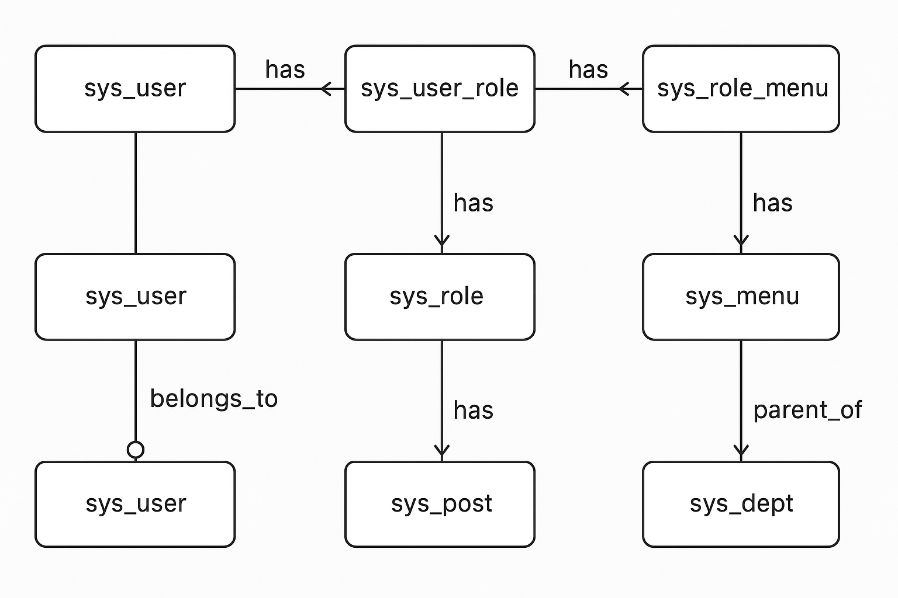

# RBAC权限设计

**分类：** 架构/安全
**创建日期：** 2026-02-24
**最后更新：** 2026-02-24

## 相关拓展文档
- [RBAC与其他权限模型的关系](rbac-design-ext-01.md)
- [RBAC在微服务架构中的应用](rbac-design-ext-02.md)

---

## 1. RBAC核心概念

RBAC（Role-Based Access Control，基于角色的访问控制）是一种权限管理模型，通过角色来管理用户对系统资源的访问权限。

### 1.1 基本元素
- **用户（User）**：系统的使用者
- **角色（Role）**：权限的集合
- **权限（Permission）**：对资源的操作许可
- **会话（Session）**：用户与角色的映射关系

### 1.2 核心关系
```
用户 ← 分配 → 角色 ← 关联 → 权限 ← 控制 → 资源
```

## 2. RBAC模型层级

### 2.1 RBAC0（基础模型）
- 用户-角色分配
- 角色-权限关联
- 用户通过角色获得权限

### 2.2 RBAC1（角色继承）
- 角色可以继承其他角色的权限
- 支持角色层级结构
- 简化权限管理

### 2.3 RBAC2（约束模型）
- 引入约束条件
- 互斥角色约束
- 基数约束（角色分配数量限制）
- 先决条件约束

### 2.4 RBAC3（完整模型）
- 包含RBAC0、RBAC1、RBAC2的所有特性
- 最完整的RBAC实现

## 3. 角色-部门-岗位关系

### 3.1 关系图


### 3.2 设计要点
1. **角色与岗位分离**：角色定义权限，岗位定义职责
2. **部门作为组织单元**：部门可以包含多个岗位
3. **用户多重归属**：一个用户可以属于多个部门，担任多个岗位
4. **权限继承机制**：上级角色/岗位可以继承下级权限

## 4. 数据库设计

### 4.1 核心表结构
```sql
-- 用户表
CREATE TABLE sys_user (
    id BIGINT PRIMARY KEY,
    username VARCHAR(50) UNIQUE,
    -- 其他字段...
);

-- 角色表
CREATE TABLE sys_role (
    id BIGINT PRIMARY KEY,
    role_code VARCHAR(50) UNIQUE,
    role_name VARCHAR(100),
    -- 其他字段...
);

-- 权限表
CREATE TABLE sys_permission (
    id BIGINT PRIMARY KEY,
    perm_code VARCHAR(50) UNIQUE,
    perm_name VARCHAR(100),
    resource_type VARCHAR(50),
    -- 其他字段...
);

-- 用户-角色关联表
CREATE TABLE sys_user_role (
    user_id BIGINT,
    role_id BIGINT,
    PRIMARY KEY (user_id, role_id)
);

-- 角色-权限关联表
CREATE TABLE sys_role_permission (
    role_id BIGINT,
    perm_id BIGINT,
    PRIMARY KEY (role_id, perm_id)
);
```

### 4.2 扩展表（部门岗位）
```sql
-- 部门表
CREATE TABLE sys_department (
    id BIGINT PRIMARY KEY,
    dept_code VARCHAR(50) UNIQUE,
    dept_name VARCHAR(100),
    parent_id BIGINT,
    -- 其他字段...
);

-- 岗位表
CREATE TABLE sys_position (
    id BIGINT PRIMARY KEY,
    position_code VARCHAR(50) UNIQUE,
    position_name VARCHAR(100),
    dept_id BIGINT,
    -- 其他字段...
);

-- 用户-岗位关联表
CREATE TABLE sys_user_position (
    user_id BIGINT,
    position_id BIGINT,
    is_primary BOOLEAN DEFAULT TRUE,
    PRIMARY KEY (user_id, position_id)
);
```

## 5. 权限验证流程

### 5.1 登录认证
1. 用户输入凭证
2. 系统验证身份
3. 加载用户角色和权限
4. 创建安全上下文

### 5.2 权限检查
```java
// 示例：Spring Security权限检查
@PreAuthorize("hasRole('ADMIN') or hasPermission('user', 'read')")
public User getUserById(Long id) {
    // 业务逻辑
}
```

### 5.3 动态权限
- 基于URL的权限控制
- 基于方法的权限控制
- 基于数据的权限控制

## 6. 实施建议

### 6.1 角色设计原则
1. **最小权限原则**：角色只包含必要的权限
2. **职责分离原则**：互斥角色不能分配给同一用户
3. **可扩展性原则**：支持角色继承和组合
4. **可维护性原则**：角色定义清晰，易于管理

### 6.2 权限粒度控制
- **粗粒度权限**：模块级别访问控制
- **细粒度权限**：数据级别访问控制
- **操作权限**：增删改查等操作控制

### 6.3 性能优化
1. 缓存用户权限信息
2. 批量查询权限数据
3. 使用索引优化查询
4. 定期清理无效权限

## 7. 常见问题

### 7.1 权限冲突处理
- 当用户拥有多个角色时，权限取并集
- 互斥角色约束防止权限冲突
- 权限优先级机制

### 7.2 权限变更同步
- 角色权限变更实时生效
- 用户角色变更需要重新登录或刷新权限
- 批量权限变更的原子性保证

### 7.3 审计日志
- 记录权限分配和变更
- 跟踪用户权限使用情况
- 安全事件审计追踪

---

*本文档提供了RBAC权限设计的基本框架，具体实现需要根据项目需求进行调整。*